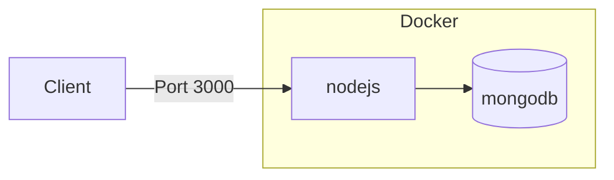

# Hvordan docker er setup {ignore=true}

Jeg har lavet den her dokument til at fortælle hvordan det hele virker det jeg har setup i docker. Så godt jeg kan.

[TOC]

## Docker-compose


Jeg har sat det op så der kommer 2 container til at kører det. En til mongo DB som bliver hente det fra dockerhub, og en der bliver bygget ud fra [dockerfile](#dockerfile).

Og hvor ved den bygget bliver kaldt for `nodejs`, og den har port 3000 åben som client kan til gå til api'en.

Databasen har også en port åben på 27017, men den er kun åben for at kunne få adgang til ud om api for at debug i det her tilfælde, men man kan godt have den åben til at andet.

```yaml
version: '3'
services:
  nodejs:
    build: .

    depends_on:
      - mongodb

    environment:
      DB_HOST: mongodb
      DB_USER: ${MONGO_ROOT_USERNAME}
      DB_PASS: ${MONGO_ROOT_PASSWORD}
      DB_DATABASE: skoleDB

    ports:
      - '3000:3000'

  mongodb:
    image: mongo:5.0
    restart: always
    environment:
      MONGO_INITDB_ROOT_USERNAME: ${MONGO_ROOT_USERNAME}
      MONGO_INITDB_ROOT_PASSWORD: ${MONGO_ROOT_PASSWORD}
    ports:
      - 27017:27017
    volumes:
      - mongodb_data_container:/data/db

volumes:
  mongodb_data_container:
```

Databasen har en volumen tilsluttet for at den kan gemme de data der bliver gemt i databasen, så hvis containeren går ned eller fordi man vil udskifte containeren med en ny eller ældre version. Så vil dataen der bliver gemt ikke gået tabt.

### Hvad er env-file

En env-file er en file der indeholder variables. File navn er standard `.env`[^env-file]. Man kan godt navngive file for nåde andet, men så skal man tilføjer mere til kommando linje.

Hvis man bruger standard file navn og den ligger ved siden af docker-compose file skal man ikke tilføjer mere til kommando linjen.

Sådan ser filen ud inden for ned under.
```
MONGO_ROOT_USERNAME=<username>
MONGO_ROOT_PASSWORD=<password>
```

> Hvis i er tvivl om hvordan `.env` file fungere, så fungere den som en normal variabel som man koder det.
>
> Så er der her et eksempel:
> `<Variabel navn>=<Variabel værdi>`

[^env-file]: [https://docs.docker.com/compose/environment-variables/](https://docs.docker.com/compose/environment-variables/)

Den her file kommer ikke med i git da der indeholder fortrolig data.

## Komando til docker-compose
For at sætte det op skal man bruge den her komando:
```bash
docker-compose up
```
Hvis man vil have det til at kører det i baggrunden skal man tilføjer `-d` til komando.
```bash
docker-compose up -d
```

For at tage det ned skal man bruge den her komando:
```bash
docker-compose down
```
Hvis man også vil have tage volume ned også så skal man tilføjer `-v` til komando.
```bash
docker-compose down -v
```

Man kan også slette image som man har fået docker-compose til lave eller slette de image der bliver brugt til docker-compose plus det der er bygget image ved at tilføjer `-rmi` og der efter vælge om det er `local` eller `all`
```bash
docker-compose down -rmi local
```

## Dockerfile

Nedenunder viser der et blueprint som er `dockerfile` som fortæller docker hvordan den skal bygge image i det her projekt.

```dockerfile
FROM node:14-alpine3.10 as ts-compiler
WORKDIR /usr/app
COPY package*.json ./
COPY tsconfig*.json ./
RUN npm install
COPY . ./
RUN npm run build

FROM node:14-alpine3.10 as ts-remover
WORKDIR /usr/app
COPY --from=ts-compiler /usr/app/package*.json ./
RUN npm install --only=production
COPY --from=ts-compiler /usr/app/build ./

FROM gcr.io/distroless/nodejs:14
WORKDIR /usr/app
COPY --from=ts-remover /usr/app ./
USER 1000
CMD ["server.js"]
```

### Hvordan virker det?

Jeg har sat det op i 3 processor


Det er kun Final proces delen der bliver til et image. De 2 andre ts-compiler og ts-remover vil ikke komme med i image kun det der er bygget.

#### ts-compiler

I den her del compiler den typescript filerne. Den kopier `package.json` og `tsconfig.json` filer ind og installer de packet fra dependencies og dev-dependencies. Og der efter kopier den resten ind. Og compiler alle typescript filerne i en mappe der hedder Build.

> Hvorfor kopier man ikke det helle ind og der efter installer packet og compiler det?
>
> Man kunne godt gør det, men docker cache system[^docker-cache] fungere sådan at den cacher være linje den udfør af proces, så den ikke skal lave den samme proces igen og igen når du skal bygge det her image. Hvis der er lavet ændringer en eller flere filer der bliver kopier ind, så vil den ikke bruge cachen fra den linje hvor der kopier filer ind og nedad.
>
> Det vil sige at hvis jeg gjorde det med at kopier alt ind på en gang, så vil docker install packet igen og igen være gang man ændringer en eller flere filer der bliver kopier ind.
> 
> Så den måde jeg har sat det op på er at den ikke skal install packet igen og igen være gang der bliver ændringer filer. Men kun hvis `package.json` eller `tsconfig.json` bliver ændringer på fx at der bliver install en ny packet.

[^docker-cache]: [https://docs.docker.com/develop/develop-images/dockerfile_best-practices/#leverage-build-cache](https://docs.docker.com/develop/develop-images/dockerfile_best-practices/#leverage-build-cache)

```dockerfile
FROM node:14-alpine3.10 as ts-compiler
WORKDIR /usr/app
COPY package*.json ./
COPY tsconfig*.json ./
RUN npm install
COPY . ./
RUN npm run build
```
#### ts-remover

I den her del henter den alt fra mappen Build og `package.json` i ts-compiler proces delen. Og installer kun de packet fra dependencies, så den bliver letter i image. Den vil ikke install dev-dependencies packet fordi det bliver kun bruget i build eller develop fasen.

```dockerfile
FROM node:14-alpine3.10 as ts-remover
WORKDIR /usr/app
COPY --from=ts-compiler /usr/app/package*.json ./
RUN npm install --only=production
COPY --from=ts-compiler /usr/app/build ./
```
#### Final

I den her del henter den alt fra ts-remover proces delen og image is done.

> Jeg kunne have stoppe i ts-remover proces delen og udgive image der fra, men google har lavet et image[^google-images] der er mere letter i størrelsen.

[^google-images]: [https://github.com/GoogleContainerTools/distroless/tree/main/nodejs](https://github.com/GoogleContainerTools/distroless/tree/main/nodejs)

```dockerfile
FROM gcr.io/distroless/nodejs:14
WORKDIR /usr/app
COPY --from=ts-remover /usr/app ./
USER 1000
CMD ["server.js"]
```
